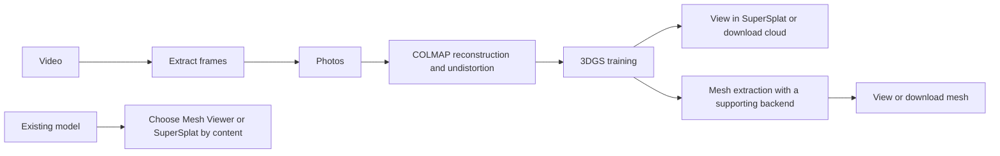

# Using Recon Studio After Startup

[Documentation](README.md) · [Development/deployment/use](workflows.md) · [繁體中文](../zh-TW/usage.md)

Start here once the panel is running. For installation or service setup, see
[Deployment](workflows.md#2-deploy-or-update-the-workstation). Quoted Chinese text
below identifies the actual interface buttons; the instructions are in English.

## Choose the outcome before starting

This guide assumes an administrator has started the panel. Everyday use does not
require learning Python, Conda, or shell commands. For a first run, use a manageable
set of clear photos with overlapping views, inspect each stage, then move to the
full production input. Examples do not guarantee a reconstruction or completion time.

| Goal | Start here | Completion means |
| :--- | :--- | :--- |
| Viewable 3DGS from photos/video | [Photos](#photos) / [Video](#video) | Training finished and this model opens in SuperSplat |
| Triangle mesh or textured files | [Mesh part of the photo workflow](#photos) | Train with a Mesh-capable backend, extract, inspect and download; check capability before training |
| Inspect an existing model | [Viewers](#viewers) | Choose mesh versus point-cloud viewing; no retraining |
| Mask, fuse captures, generate depth, or partition | [Optional tools](tools.md) | Check that tool's outputs; you do not need to run every tool |
| Recover work or diagnose a failure | [Jobs](#jobs) / [Troubleshooting](#troubleshooting) | Locate the correct job, artifact path and next action |

### Workflow map



**Each transition requires you to review and submit the next form.** Transfers,
image viewing, and measurements can also be used independently.

### Contents

1. [Open the panel and check readiness](#start)
2. [Workspace controls](#workspace)
3. [Inputs, file pickers, and paths](#inputs)
4. [Photos → COLMAP → training → optional Mesh](#photos)
5. [Video extraction fields and steps](#video)
6. [Viewers, measurement, and point-cloud editing](#viewers)
7. [Progress, cancellation, reruns, and deletion](#jobs)
8. [Artifacts and browser-based acceptance](#finish)
9. [Troubleshooting by symptom](#troubleshooting)

<a id="start"></a>

## 1. Open the panel and check readiness

1. Open the URL printed by `./run.sh`. Use the local URL on the server itself.
   From another computer, use the configured LAN HTTPS URL and deployment credentials.
   That computer's `127.0.0.1` points to itself, not to the server.
2. If the persistent service is already running, open its URL without starting
   another `run.sh`. For a foreground launch, keep the server terminal open.
3. Click the top-right environment check, “環境檢查”, and verify the tools needed
   for your operation: ffmpeg, COLMAP, or the selected training backend. Resolve a
   backend marked “環境未就緒” before submitting training work.
4. The header connection indicator concerns live updates. Check the job's actual
   status and logs in the current-work tab to follow execution.

### What you should see

The page shows Recon Studio, a top-left “＋ 建立任務” button, and a top-right
“環境檢查” link. A fresh visit usually shows the input cards; a job link opens that
job instead, so use “工作區首頁” to return. Settings may initially be collapsed:
expand them before assuming the installation is missing a form.

| What appears | Next action |
| :--- | :--- |
| Username/password prompt | Use the deployment's nginx credentials, not GitHub/Google login |
| Workspace loads but a backend is disabled | Check that backend in “環境檢查”; send the failure to the administrator |
| Connection failure or 502 | Verify the URL, then ask the administrator to check service/proxy [diagnostics](workflows.md#diagnose-the-correct-layer) |
| Live updates disconnected | Reopen the job and inspect logs; this does not mean server work was cancelled |

<a id="workspace"></a>

## 2. Find your way around

| Interface entry | Purpose |
| :--- | :--- |
| 工作區首頁 | Workspace home: choose video, photos, or an existing 3D model |
| ＋ 建立任務 | Expand task settings; use “切換功能” to select a stage or tool |
| 目前工作 | Current job progress, logs, results, or the model viewer |
| 任務紀錄 | Search old jobs, filter by type/status, then click “開啟” |
| 收合設定 | Collapse settings to give the logs or model more space |

Switching workspace tabs preserves the form and current work. After refreshing,
find submitted jobs in history; use “複製任務連結” to save a link to a specific job.
An unsubmitted form is not a saved job.

### Repeat these five steps for each task

1. Choose a home card or expand settings with “＋ 建立任務”.
2. Expand “切換功能” and choose the required function; its form becomes visible.
3. Fill required paths and check the output destination. A `?` reveals field help;
   click advanced-section headings to expand them only when needed.
4. Press the form's start button once. Wait while “正在送出…” is shown; correct any
   validation message beside the form rather than resubmitting repeatedly.
5. In “目前工作”, confirm a job ID/status and logs exist. Collapse settings for more
   space once submission is confirmed.

On narrow displays, settings and results can stack vertically; use the “設定素材”
and “查看工作與紀錄” navigation links. Collapsing settings does not stop a task.
Current work displays one opened job/model; reopen others from history. Workspace
tabs also support arrow keys and Home/End.

<a id="inputs"></a>

## 3. Choose the entry for your input

| What you have | First action | Next stages |
| :--- | :--- | :--- |
| Video | Home → “我有影片” | Extract frames → COLMAP → training → optional Mesh |
| Photo folder | Home → “我有照片” | COLMAP → training → optional Mesh |
| GCS data | Create task → switch function → “資料” | Download to the server, then choose frames/COLMAP |
| Finished COLMAP workspace | Enter its workspace in COLMAP and click “讀取既有結果” | View cloud/cameras; training also needs usable undistorted images/model |
| Mesh file | Home → “我有 3D 模型”, or Mesh Viewer | View directly without retraining |
| 3DGS or point cloud | Create task → switch function → SuperSplat | Open directly, or from a completed training job |

**Training and reconstruction paths refer to the server running the panel.** Their
“瀏覽” picker does not upload photos from your current computer. Put inputs on
readable server storage first, or use the GCS transfer tool. After a GCS download,
manually choose the downloaded folder in the relevant function; reconstruction
does not start automatically.

Only viewers with an explicit local-file/drag-and-drop entry can open models from
your current computer directly. A `.ply` file can contain a mesh or a point cloud;
choose the viewer according to its content.

### Terms used in the forms

| Term | Meaning for the operator |
| :--- | :--- |
| Server | Computer running the panel, COLMAP and training; possibly not your browser computer |
| Source photos/video | Existing input files, not a folder you expect the tool to create |
| workspace | This COLMAP run's database, reconstruction and undistorted dataset location |
| Undistortion | Camera-based image correction; training needs the matching images and camera model |
| source | Dataset consumed by training/a tool; not necessarily the original photo directory |
| Model output | Destination for this training result; do not enter the source photo directory |
| Backend | Program performing training; parameters, outputs and Mesh support vary |
| Job ID | Identifier for one execution; the same input can have several distinct jobs |

### Use the Browse picker correctly

1. Click “瀏覽” beside the intended field. The path at the top is a **server directory**.
2. Click a directory to enter it, or `⬆ ..` to go up. Folder-selection mode does not
   list photos, so an empty subfolder list does not mean there are no photos there.
3. Click “選此資料夾” to apply that directory to the field. Merely entering it is not selection.
4. Model-file mode lists supported extensions; click the actual file to select it.
5. For a new output folder, type its full path into the form and verify the parent
   storage is writable. The picker does not create directories; task validation
   determines whether the selected destination can be created.

If a path is missing, confirm server storage and browse-root settings with the
administrator. Do not paste `C:\Users\...` or another computer's desktop path.
Paste server paths without shell-style enclosing quotes; preserve spaces and
non-English characters. Keep inputs and outputs separate, for example:

```text
/Disk0/my-scan/
├── images/             ← existing photos; inspect in the image viewer first
├── videos/             ← original video if using frame extraction
├── frames-run-01/      ← extraction output
├── colmap-run-01/      ← this reconstruction workspace
└── model-run-01/       ← this training output
```

This is a directory plan, not folders automatically created at startup. Backend
model filenames differ; use the completed job's actual outputs/download actions
instead of guessing a fixed checkpoint filename.

<a id="photos"></a>

## 4. First walkthrough: photos to a viewable model

These are example paths. Replace them with readable/writable locations on your
server; `/Disk0` is not required. Have the photos in place first, and use distinct
output directories for comparison runs.

| Purpose | Example |
| :--- | :--- |
| Source photos | `/Disk0/my-scan/images` |
| This COLMAP workspace | `/Disk0/my-scan/colmap-run-01` |
| This model output | `/Disk0/my-scan/model-run-01` |

### A. Reconstruct the photos

**Goal:** recover camera positions and a point cloud, then prepare matching
images/cameras for training.

| Field/section | First-run value | Check before submission |
| :--- | :--- | :--- |
| 照片資料夾 | `/Disk0/my-scan/images` | Contains this input's photos, not trained models |
| 重建工作目錄 | `/Disk0/my-scan/colmap-run-01` | Separate comparison destination; writable with space available |
| 影像解析度 | Default longest side ≤ 1920 | Resized copies feed the pipeline; masks must match image dimensions |
| GPU | Available GPU assigned to you | Applies to all COLMAP stages; the default can use all GPUs |
| layout | Automatic detection for a simple first case | Read advanced guidance for multi-folder/camera input; do not enable rig arbitrarily |
| Matching/Mapping | Keep displayed defaults initially | Matching/reconstruction strategies are not switches that all need enabling |
| Pipeline/STAGES | Keep the initial complete stage selection | Preserve undistortion when training afterward |
| FORCE | Leave unchecked initially | Forced reruns differ from experiments in a new output directory |

1. Click “我有照片”, or create a task and switch to COLMAP.
2. Select the source in “照片資料夾” and the output in “重建工作目錄”. For a first run,
   keep the default resolution/stage selection; retain undistortion for training.
3. Click “啟動 COLMAP” once. In “目前工作”, confirm a job was created. “排隊中” means
   waiting for an execution slot; “執行中” means stage execution has started.
4. When the status becomes “已完成”, click “檢視 3D 結果” to inspect the cloud and
   cameras. Investigate missing geometry or obviously misplaced cameras before
   investing in the training stage.

**While waiting:** stage/log updates depend on the external tool, so a continuous
percentage is not always available. CPU/GPU/storage/input size affect duration;
a short pause in logging alone is not proof of a stalled job. Check failure messages.

**After completion:** inspect cloud/camera placement and coverage of the intended
subject before training. In the COLMAP viewer, drag to rotate, use the wheel to
zoom, and `R` to reset. Selection/box modes change drag behavior; stay in navigation
mode (“導覽”) initially. Separate reconstructed components are not automatically a
complete joined scene. See [acceptance](#finish) for additional geometric checks.

The workspace normally contains `database.db` and `sparse/`; the undistorted
dataset has its own `images/` and `sparse/`. Let “接著訓練” pass the workspace rather
than guessing a subfolder. Resolve failed reconstruction through
[troubleshooting](#troubleshooting) before proceeding.

### B. Train the result

**Confirm the final output first.** A ready training backend can produce a viewable
3DGS result; if you require a mesh, verify Mesh support before training, for example
this project's GS-2M backend. Do not relabel an incompatible model as another backend.

| Field | Example/value | Meaning |
| :--- | :--- | :--- |
| 訓練後端 | Ready backend supporting the desired output | Disabled means its environment is unavailable, not just that input is missing |
| source | Prefilled `colmap-run-01` or actual undistorted dataset | Needs images and PINHOLE cameras together, not only a PLY |
| 模型輸出資料夾 | `/Disk0/my-scan/model-run-01` | A separate destination for this comparison run |
| GPU | Assigned GPU index | Multiple jobs do not automatically distribute themselves across GPUs |
| Backend parameters | Keep this backend's displayed defaults for a first run | Parameters change with backend; do not copy another backend's values blindly |
| extra/advanced flags | Empty without a specific requirement | Passed to the backend; invalid flags can immediately fail the run |

1. Click “接著訓練” on the completed COLMAP job; it fills the source workspace.
2. Confirm `source` points to this workspace or its undistorted output. Choose a
   ready backend (“訓練後端”), model output folder (“模型輸出資料夾”), and GPU.
   Parameters vary by backend; start with the selected backend's defaults.
3. Click “啟動訓練”. **Next-stage buttons fill a form; you still confirm and submit
   the next job yourself.**
4. Follow status/logs in “目前工作”; iteration and loss appear when supplied by the
   backend. On completion, record the model output path. “在 SuperSplat 去背景” opens
   the trained model for viewing; deleting background is optional. “下載點雲” downloads
   the training result.

**Expected feedback:** submission creates a separate training job ID. Iteration/loss
values describe progress; loss values are not necessarily comparable between
backends, and decreasing loss does not guarantee a visually correct model.
For missing-dataset/non-PINHOLE errors, fix COLMAP/undistortion inputs before
changing iteration counts. For GPU out-of-memory errors, check other work on that
GPU and retain the error for the administrator before adjusting resolution or
backend memory options.

Do not read an upstream stage's partial outputs while it is still running.
To revisit training, open its existing history entry rather than submitting
another run into the same destination.

### C. Extract Mesh only when needed

A completed training job offers “接著抽 Mesh” only when the backend supports it.
Click it, review the Mesh form, then click “抽取 Mesh”. On completion, use
“檢視 Mesh” or the available artifact download links. Textured, GLB, and calibrated
size downloads appear only when those artifacts exist.

Without the Mesh action, you can still view/download the point cloud. Do not assume
all trainers support mesh extraction. Uncalibrated model coordinates are not
physical millimetres; confirm scale and units before measuring.

#### Review the Mesh form and outputs

| Item | Action |
| :--- | :--- |
| 模型處理後端 | Installed Mesh backend compatible with this model |
| 已訓練模型的資料夾 | Prefilled `model-run-01`, not a single cloud file or photo folder |
| GPU/Mesh parameters | Start with applicable backend defaults and confirm GPU assignment |
| 照片貼圖 | Use when you want photo textures; needs matching images and texture-tool dependencies |
| 另存單檔 GLB | Keep for a portable textured file and confirm it was actually generated |
| Marker calibration | Use only with the photographed calibration board and known physical geometry; arbitrary mm values do not establish scale |
| Edited point cloud | Optional SuperSplat-exported PLY; leave empty if no edits |

1. Confirm model directory/backend and click “抽取 Mesh”.
2. Follow extraction/texturing logs until the job completes.
3. Use “檢視 Mesh” to inspect surfaces and shape, then “量測高寬深” for orientation/scale.
4. Download the required artifact: original mesh, generated GLB, or the textured
   OBJ package. OBJ materials need the MTL and texture images; keep them together.
5. For a plain untextured mesh, check whether texturing actually ran and produced
   artifacts before declaring reconstruction failed.

#### When no Mesh action appears

Confirm training has completed and its backend supports Mesh. Cloud-only results
remain usable in SuperSplat. A changed mesh requirement needs a compatible
training/extraction workflow; renaming a file to `.obj` does not convert it.

<a id="video"></a>

## 5. Start from video instead

**Entry:** “我有影片”, or create task → switch function → frame extraction.
The source is an existing server video file/directory; directory input includes
nested directories.

| Field | First-run example/default | Meaning |
| :--- | :--- | :--- |
| 影片來源 | `/Disk0/my-scan/videos` or one full video path | Server files must already exist |
| 影格輸出資料夾 | `/Disk0/my-scan/frames-run-01` | Per-video `frames_<name>/` output; inspect the actual result |
| 每秒抽幾張 | `1` | Sampling frequency, not a guarantee of one retained frame per second |
| Filtering mode | Dual filter by default | Pass quality threshold, then limit the sharpness-ranked count |
| Blur-score ceiling | `8` | Lower is stricter; score distributions vary by input |
| Maximum retained percentage | `70%` | An upper limit, not permission to retain frames that fail the threshold |

1. Set source and this run's destination; start with displayed filtering defaults.
2. Click “抽幀並移除模糊影格” once.
3. Watch per-video progress and kept/rejected counts in current work.
4. When complete, open the extracted photos through “圖片”; inspect sharpness and view coverage.
5. Click “接著跑 COLMAP”, confirm workspace, then separately submit “啟動 COLMAP”.

**Example:** a 60-second video sampled at `1` per second is roughly one sample each
second; decoding, scoring, and filtering determine the final count. It does not
promise exactly 60 or 42 output photos. If too few survive, inspect
`blur_scores.csv` and the quality report to distinguish poor input from strict
filtering. Percentage-only mode removes the absolute blur-threshold protection;
always inspect retained frames after changing settings. Severely blurred footage
needs better input, not just looser filtering.

Resolve failures/empty outputs before passing them to COLMAP.

<a id="viewers"></a>

## 6. Open an existing model without running a pipeline

- **Mesh:** “我有 3D 模型” opens Mesh Viewer. Select a server `.ply/.obj/.stl/.glb`
  and click “開啟 Viewer”, or leave the path empty and select/drop a local file in
  the viewer.
- **Cloud/3DGS:** switch to SuperSplat and choose a server file, then click
  “開啟 SuperSplat”. Alternatively leave the path empty and open/drop a local file
  in the editor. Completed training jobs also open their own results directly.
- **Large training results:** when opened from a training job, wait for loading
  to finish. Use “編輯畫質” → “流暢（大場景）” to reduce display load.
  “停止載入／關閉模型” closes this viewer; it is not the training-job cancel action.
- **Loading failure:** read the displayed error and version. SuperSplat v3 needs
  HTTPS/localhost and a usable WebGPU adapter. Follow the environment guidance,
  then use “重試目前版本”; explicitly choose “使用相容版” when a legacy bundle is
  available. Loading the web page does not establish GPU availability or prove
  that the model is corrupt.

### Mesh Viewer mouse controls and toolbar

These apply to standalone/job Mesh viewers. SuperSplat is a separate editor and
does not share every shortcut.

| Goal | Action | If it does not behave as expected |
| :--- | :--- | :--- |
| Change angle | Left-drag in the model area | Turn off measurement/object-alignment modes first |
| Zoom | Scroll with the pointer over the model | Scrolling over page text scrolls the page instead |
| Pan | Right-drag in the model area | Ensure focus is in the model area |
| Recover an off-screen model | “重置視角” | Refits the current model without rerunning a job |
| Inspect triangles | Enable “線框” | Disable afterward to assess appearance |
| Change lighting | “亮度”, optionally “白底” | Display/background settings do not change exported geometry |
| Correct upside-down display | Check “翻轉(COLMAP Y-down)” or alignment | Coordinate conventions differ by format |
| Measure a distance | Enable “量尺”, click two surface points | Hits must be on surfaces; “清除” starts a new measurement |

**The mm/cm/m selector changes the label only; it does not rescale file values.**
Arbitrary reconstruction coordinates do not become calibrated millimetres by
selecting mm. See [measurement](tools.md#measure) for full dimensions and scale factors.

### Inspect and remove background in a training job's SuperSplat

1. Open “在 SuperSplat 去背景” on completed training. Wait through reading/parsing/GPU
   preparation until the loaded status (“已載入”) appears.
2. Confirm version and visible model. For a large scene choose “編輯畫質” →
   “流暢（大場景）”. This reduces display load; it does not reduce original point
   counts or convert the source result to a lower-precision model.
3. For inspection only, stop here. To edit, select the **subject to keep**, use
   `Ctrl+I` to invert selection, then Delete to remove background. Use `Ctrl+Z`
   immediately after a mistake and verify selection before sending anything back.
4. Click the outer “送回去背點雲” and wait. Mesh-capable backends prepare a derived
   model and prefill Mesh; you still confirm and submit extraction. Other backends
   provide the cleaned-cloud download.
5. Finish send-back or editor export before returning to the job/closing the model.
   The job integration preserves the original and stores derived results separately;
   do not assume unsent edits have been automatically saved.

These outer quality/send-back controls belong to the training-job integration.
For standalone SuperSplat file viewing, use that editor's loading/export controls.
Legacy selection after a v3 startup failure displays the selected version explicitly.

<a id="jobs"></a>

## 7. Monitor, cancel, and revisit jobs

| Status or need | Action |
| :--- | :--- |
| 排隊中 | Wait for a slot; do not resubmit the same work |
| 執行中 | Follow stages/logs; scroll up to pause following, “移至最新” to return to the tail |
| 已完成 | Inspect output paths and view/download actions, then decide the next stage |
| 失敗 | Record job ID, displayed error and logs; fix the cause before resubmitting |
| Stop work | Click “取消任務” on a queued/running job and wait for cancellation status |
| Revisit a job | Search “任務紀錄” by name, ID or path, filter type/status, then click “開啟” |
| Full logs | Click “下載完整紀錄”; the on-screen view retains at most 5,000 recent lines |
| Connection fails after submission | Check job history for an existing job before submitting again |

Use “清除篩選” to reveal jobs hidden by filters. Switching tabs or closing a browser
is not server-job cancellation; the server must remain running. Closing its
foreground terminal or restarting the service affects work, and jobs do not
resume automatically after restart. Follow the
[update procedure](workflows.md#update-an-existing-deployment) before stopping it.

### Rerun and compare deliberately

After failure, download logs and retain job ID/error. Return to the relevant form,
fix input/path/environment, and use new workspace/model paths for a comparison,
e.g. `colmap-run-02` and `model-run-02`. Some stages can skip existing artifacts,
but resume rules differ; resubmission is not a universal resume command.
Use FORCE/overwrite only when you intentionally need to rebuild existing outputs.

Concurrent jobs share machine resources. The queue's concurrency limit is not an
automatic GPU scheduler; simultaneous training on one GPU can exhaust memory.
Complete one run first before increasing parallel work.

### Before deleting job history

1. Save required outputs, paths, parameters, and full logs first.
2. Select specific rows in history, click “刪除選取”, and read the confirmation.
3. Active/queued jobs are cancelled first and keep their records; delete again
   after they finish to remove records and files inside their job directories.
4. History deletion is not a complete dataset/model disk-cleanup operation:
   external workspaces normally remain. Files stored inside a job's own directory
   are removed, so it is not a long-term backup location.

<a id="finish"></a>

## 8. Confirm a successful first run

- The job is completed; retain its link, parameters, and actual output location.
- Frames, COLMAP cloud/cameras, or the trained model open in the appropriate
  viewer and correspond to the intended input.
- Keep/download important results as needed. Feed the actual new output into the
  next stage, rather than a similarly named old directory.
- Completion means the process finished; quality still needs acceptance checks.
  See [Evaluate](README.md#evaluate) for geometry and use the trainer's workflow
  for rendering metrics.

### COLMAP geometric acceptance without a command line

This is an additional geometry check, not a mandatory step for every independent tool.

1. Open `/verify` on the same panel origin, e.g. `http://127.0.0.1:8077/verify`;
   use your actual port/HTTPS hostname.
2. Enter this COLMAP workspace in “模型目錄或 workspace”, or choose a recent COLMAP job.
3. Use its matching `database.db`; a blank field triggers nearby-path detection.
   `case manifest` must belong to this case. Do not borrow another project's
   calibration/EO file simply to populate the field.
4. For undistorted models, confirm “模型已去畸變（跳過對極測試）”: their coordinates differ
   from the original image database. Start with `12` samples per group, click
   “執行驗收”, and wait for the text result.
5. Record passed, failed, and skipped checks. Skipped is not passed; a viewable
   model is not proof of measurement accuracy. If pycolmap is unavailable, ask the
   administrator to configure the checker as instructed on the page.

This evaluates COLMAP geometry, not rendering metrics for every 3DGS backend.

### Keep an experiment record

```text
Project/input:
COLMAP job ID and workspace:
Training job ID/backend/GPU:
Parameters changed for this run:
Model and Mesh output paths:
Saved logs/downloads:
Visual inspection and acceptance (including skipped checks):
```

<a id="troubleshooting"></a>

## 9. Troubleshooting: what to inspect and what to do next

| Problem | Check first | Next action |
| :--- | :--- | :--- |
| No form on the left | Collapsed settings | “＋ 建立任務”, then “切換功能” |
| Folder visible but photos absent | Folder-selection mode | Use “選此資料夾”; inspect photos with “圖片” |
| Cannot find desktop files | Browser computer versus server | Transfer to the server; only explicit viewer-local file input reads client files |
| Invalid input/output path | Spelling, enclosing quotes, permissions, parent storage | Correct the form; refreshing cannot fix the path |
| Start button seems unresponsive | Required fields, sending state, current work/history | Check whether a job was created before resubmitting |
| Too few extracted frames | Logs, retained counts, `blur_scores.csv` | Distinguish blurred input from strict filtering, then adjust or recapture |
| COLMAP completes with missing areas | Photos and camera/cloud distribution | Check view connectivity, masks and inputs; more training cannot invent missing reconstructed views |
| Missing undistortion/non-PINHOLE | COLMAP stages and actual dataset | Produce the correct undistorted output, then hand off that workspace |
| Backend disabled | Environment check | Repair it or choose another ready backend supporting the desired result |
| GPU out of memory | Other jobs, resolution, backend settings | Reduce competing work and follow backend memory guidance; keep full error |
| Job stays queued | Active work/concurrency limit | Wait or cancel intentionally; do not submit duplicates |
| Job seems missing | Search/type/status filters | Clear filters and search ID/output path |
| Cloud but no Mesh button | Backend Mesh capability | Use SuperSplat and plan a compatible Mesh workflow |
| White/untextured mesh | Correct file and generated texture artifacts | Use generated GLB or complete OBJ/MTL/texture package; check texturing logs |
| Measurement is not plausible mm | Actual model calibration | Unit labels do not convert values; use established scale/board calibration |
| Old SuperSplat version | Displayed version, background build, legacy choice | Confirm build success, then refresh/reopen; panel startup does not mean build completion |
| No adapter/editor startup failure | HTTPS/localhost, acceleration, WebGPU | Follow displayed guidance, retry or explicitly select legacy; retraining alone will not fix the GPU |
| Job failed after restart | Whether it was queued/running at restart | Inspect partial artifacts/logs and decide how to rerun; automatic resume is not guaranteed |

For further help, provide job ID/link, function, source/output paths, backend,
full logs and the error text. Viewer issues also need browser/GPU and displayed
version. Do not include passwords or cloud credentials.

For detailed parameters see the [operator manual (Traditional Chinese)](../zh-TW/user-guide.md#二使用).
For connectivity, version, or service issues see [layered diagnosis](workflows.md#diagnose-the-correct-layer).
