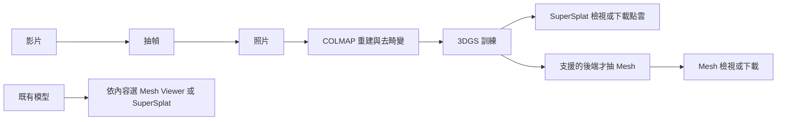

# 啟動後操作指南

[文件首頁](README.md) · [開發／部署／使用流程](workflows.md) · [完整操作手冊](user-guide.md) · [English](../en/usage.md)

本頁從「面板已啟動」開始，帶你完成第一次操作。安裝或服務尚未完成時，先看[部署流程](workflows.md#2-部署或更新工作站)。

## 先決定你這次要完成什麼

本教學假設管理者已讓面板啟動；一般使用者不需要先懂 Python、Conda 或指令列。
第一次可先用一組清楚、相鄰視角有重疊的照片走完流程，確認每階段結果，再換正式大量素材。
範例是操作示範，不保證任何素材都能重建成功，也沒有固定的完成時間。

| 目標 | 從哪裡開始 | 何時算完成 |
| :--- | :--- | :--- |
| 把照片／影片做成可看的 3DGS | [照片流程](#photos)／[影片流程](#video) | 訓練完成，SuperSplat 可開啟本次模型 |
| 需要三角網格或貼圖檔 | [照片流程的 Mesh 段落](#photos) | 用支援 Mesh 的後端訓練，抽取後檢查並下載；選後端前先確認 Mesh 能力 |
| 只想看已有模型 | [檢視器操作](#viewers) | 正確選擇 Mesh／點雲檢視器，不需要重新訓練 |
| 想去背、融合、產生深度或切大場景 | [選用工具教學](tools.md) | 依該工具的輸出檢查，不需要把所有工具都跑一遍 |
| 找回之前的工作、處理錯誤 | [任務管理](#jobs)／[常見問題](#troubleshooting) | 找到正確任務、輸出位置及下一個處理步驟 |

### 操作順序地圖



**每個箭頭都需要你確認下一步的表單再提交。**「資料」搬檔、圖片檢視、量測等可獨立使用。

### 本頁導覽

1. [開啟面板與環境檢查](#start)
2. [畫面導覽與按鈕位置](#workspace)
3. [素材、檔案選擇與路徑](#inputs)
4. [照片 → COLMAP → 訓練 → 選用 Mesh](#photos)
5. [影片抽幀的欄位與操作](#video)
6. [檢視器、量尺與點雲編輯](#viewers)
7. [進度、取消、重跑與刪除紀錄](#jobs)
8. [成果與瀏覽器驗收](#finish)
9. [常見問題逐項排查](#troubleshooting)

<a id="start"></a>

## 1. 開啟面板並確認環境

1. 在瀏覽器開啟 `./run.sh` 印出的網址。直接在伺服器操作可用本機網址；
   從另一台電腦使用時，開啟已設定的區網 HTTPS 網址，並輸入部署時建立的帳密。
   另一台電腦的 `127.0.0.1` 指向它自己，不能拿來連伺服器。
2. 常駐服務已啟動時，直接開網址，不用再執行一次 `./run.sh`。
   前景啟動則保留啟動面板的終端機。
3. 按右上角「環境檢查」，確認本次要用的 ffmpeg、COLMAP 或訓練後端可用。
   後端顯示「環境未就緒」時先完成該後端設定，不能靠重複提交任務解決。
4. 頁面頂端的連線狀態表示即時更新是否連上；任務實際進度請看「目前工作」的狀態與日誌。

### 打開後應該看到什麼

頁面左上角顯示 Recon Studio，上方有「＋ 建立任務」與右側「環境檢查」。
新進入通常可看到首頁素材卡；若使用任務連結進入，會直接顯示那筆工作，按「工作區首頁」即可返回。
設定側欄預設可能收合，找不到欄位時先按「＋ 建立任務」，不是重新安裝專案。

| 你看到的情況 | 下一個動作 |
| :--- | :--- |
| 要求帳號密碼 | 使用管理者提供的 nginx 帳密，不是 GitHub／Google 登入 |
| 已有工作區但後端灰色 | 「環境檢查」確認該後端；把錯誤交給管理者，不重複按啟動 |
| 瀏覽器連不上／502 | 先確認網址，再請管理者看服務與代理；[部署排錯](workflows.md#依問題層級排查)有檢查方式 |
| 進度顯示失去連線 | 重新開任務確認日誌；不代表伺服器任務已取消 |

<a id="workspace"></a>

## 2. 認識首頁與操作區

| 畫面入口 | 用法 |
| :--- | :--- |
| 工作區首頁 | 按素材類型開始：我有影片、我有照片、我有 3D 模型 |
| ＋ 建立任務 | 展開設定面板；在「切換功能」選抽幀、COLMAP、訓練、Mesh 或其他工具 |
| 目前工作 | 查看已開啟任務的進度、日誌及成果，或操作模型檢視器 |
| 任務紀錄 | 搜尋既有任務，依類別／狀態篩選，再按「開啟」查看 |
| 收合設定 | 填完表單後收起側欄，讓日誌或模型有更大的顯示空間 |

切換這三個工作區分頁會保留已填表單與目前工作。重新整理後可由任務紀錄找回任務；
需要保存同一筆工作時使用「複製任務連結」。不要把尚未送出的表單當成已保存的任務。

### 每次建立任務都照這五步

1. 選首頁素材卡，或按「＋ 建立任務」展開左側。
2. 展開「切換功能」選要用的功能；選完會切換到該表單。
3. 填完必填路徑，逐一確認輸出位置；欄位旁的 `?` 可展開說明，進階區塊可按標題展開。
4. 按表單底部的啟動按鈕一次。看到「正在送出…」就等待；欄位錯誤時留在原處修正。
5. 在「目前工作」確認有任務 ID／狀態與日誌。成功提交後可收合設定，專心看進度。

畫面較窄時，設定與工作區可能上下排列，可用「設定素材」／「查看工作與紀錄」快速移動。
「收合設定」只改畫面，不停止工作；「目前工作」一次呈現一個已開啟的任務／模型，
其他任務可從「任務紀錄」切回查看。分頁可用方向鍵及 Home／End 切換。

<a id="inputs"></a>

## 3. 依手上的素材選入口

| 你已經有什麼 | 第一個操作 | 後續流程 |
| :--- | :--- | :--- |
| 影片 | 首頁「我有影片」 | 抽幀 → COLMAP → 訓練 → 選用 Mesh |
| 照片資料夾 | 首頁「我有照片」 | COLMAP → 訓練 → 選用 Mesh |
| GCS 上的素材 | 建立任務 → 切換功能 →「資料」 | 先下載到伺服器，再依檔案類型選抽幀／COLMAP |
| 已完成的 COLMAP 工作目錄 | COLMAP 表單填工作目錄，按「讀取既有結果」 | 檢視點雲／相機；訓練還需要可用的去畸變照片與模型 |
| Mesh 網格檔 | 首頁「我有 3D 模型」或「Mesh Viewer」 | 直接檢視，不必重跑訓練 |
| 3DGS／點雲 | 建立任務 → 切換功能 →「SuperSplat」 | 直接開點雲，或由完成的訓練任務開啟 |

**素材路徑指向執行面板的伺服器。** 訓練／重建表單的「瀏覽」不是上傳你目前電腦的照片，
遠端電腦上的路徑也不能直接填給伺服器。先把素材放到伺服器可讀的位置，或用「資料」下載 GCS 素材。
GCS 下載完成後要自行到對應功能選取本機資料夾，不會自動開始重建。

只有檢視器明確提供的本機選檔／拖放入口，可以直接開你目前電腦的模型。
`.ply` 可能是網格或點雲，應依內容選 Mesh Viewer 或 SuperSplat。

### 先弄懂這幾個名詞

| 名詞 | 你要知道的意思 |
| :--- | :--- |
| 伺服器 | 實際執行面板、COLMAP 與訓練的電腦；可能不是你開瀏覽器的這台 |
| 來源照片／影片 | 已存在的輸入檔案；不是希望程式幫你建立的目錄 |
| workspace／重建工作目錄 | 此次 COLMAP 的資料庫、模型及去畸變成果存放位置 |
| 去畸變 | 依相機參數修正照片；訓練需要照片與相機模型對得上的這一組資料 |
| source | 訓練或工具要讀的來源資料集，不一定是最初的照片資料夾 |
| 模型輸出資料夾 | 此次訓練的新成果位置；不要填原始照片目錄 |
| 後端 | 真正做訓練的程式；不同後端支援的參數、輸出與 Mesh 能力不同 |
| 任務 ID | 用來找回這一次執行的識別碼；同一份素材可以有多筆不同任務 |

### 「瀏覽」怎麼選

1. 按該欄位旁的「瀏覽」。視窗上方路徑是目前正在看的**伺服器目錄**。
2. 點資料夾名稱進入，按 `⬆ ..` 回上一層。資料夾模式不列照片，不代表裡面沒有照片。
3. 到目標資料夾後按「選此資料夾」，路徑才會帶回欄位；只是進入一層還沒選好。
4. 選模型檔時會只列支援副檔名，直接點檔名即可。
5. 新輸出資料夾尚未存在時，可直接在表單輸入完整路徑；確認上層儲存位置可寫入。
   選擇器不是建立資料夾工具，輸出是否能建立仍以任務驗證結果為準。

找不到路徑時先向管理者確認伺服器位置與瀏覽根目錄；不要貼 `C:\Users\...` 或另一台電腦的桌面路徑。
一般欄位可貼完整伺服器路徑，**不加 shell 用的外層引號**。空白、中文檔名保留原樣。
輸入來源與輸出請分開，例如：

```text
/Disk0/my-scan/
├── images/             ← 已存在的照片，先用「圖片」檢查
├── videos/             ← 若是影片流程，原始影片放這裡
├── frames-run-01/      ← 抽幀時指定的輸出
├── colmap-run-01/      ← 本次 COLMAP 工作目錄
└── model-run-01/       ← 本次訓練輸出
```

這是規劃範例，不是啟動後自動存在的資料夾。模型內部檔名依後端而異，
以任務完成畫面顯示的輸出與下載入口為準，不猜固定 checkpoint 名稱。

<a id="photos"></a>

## 4. 第一次操作：從照片到可檢視的模型

以下是路徑範例，請替換成伺服器上實際存在、可讀寫的位置；不需要照抄 `/Disk0`。
照片需已放妥，各次比較實驗使用不同輸出目錄。

| 用途 | 範例 |
| :--- | :--- |
| 來源照片 | `/Disk0/my-scan/images` |
| 本次 COLMAP 工作目錄 | `/Disk0/my-scan/colmap-run-01` |
| 本次模型輸出 | `/Disk0/my-scan/model-run-01` |

### A. 重建照片

**這一步的目標：**讓程式求出相機位置與點雲，並準備可供訓練的照片／相機資料。

| 欄位／區塊 | 第一次怎麼填 | 送出前確認 |
| :--- | :--- | :--- |
| 照片資料夾 | `/Disk0/my-scan/images` | 確實含本次要重建的照片，不是模型輸出 |
| 重建工作目錄 | `/Disk0/my-scan/colmap-run-01` | 新一輪比較用新目錄，能寫入且有空間 |
| 影像解析度 | 先用預設長邊 ≤ 1920 | 會產生縮圖供流程使用；有遮罩時需與照片大小配對 |
| GPU | 確認機器可用的 GPU；共用機器依分配選擇 | 此選擇套用所有 COLMAP 階段；預設可能是全部 GPU |
| 輸入格式 layout | 普通案例先用自動偵測 | 多資料夾／多相機時再看詳細手冊，不任意打開 rig |
| Matching／Mapping | 保留畫面預設，遇到具體問題再調 | 這是匹配與重建策略，並非越多選項越好 |
| Pipeline／STAGES | 第一次保留預設全部階段 | 後續要訓練就要保留去畸變階段 |
| FORCE | 第一次保持不勾 | 強制重跑與換一個新輸出實驗不同，不用來試運氣 |

1. 按「我有照片」，或建立任務後切到「COLMAP」。
2. 在「照片資料夾」選來源照片，在「重建工作目錄」指定這次輸出。
   第一次操作可先保留預設解析度與階段選項；不要略過後續訓練需要的去畸變階段。
3. 按「啟動 COLMAP」一次，到「目前工作」確認任務已建立。
   「排隊中」代表等待執行位置；「執行中」才會逐步產生階段日誌。
4. 等狀態變成「已完成」，按「檢視 3D 結果」看點雲與相機位置。
   若物體缺大塊、相機位置明顯錯亂，先檢查素材與重建結果，再決定是否訓練。

**等待時看什麼：**階段與日誌會隨外部工具進度更新，不一定有連續百分比。
CPU、GPU、磁碟與素材數量都影響時間；日誌暫停幾秒不代表卡死，先看是否出現失敗訊息。

**完成後看什麼：**按「檢視 3D 結果」，確認相機與主體大致合理、照片涵蓋預期範圍，
不要只看到「已完成」就跳下一步。COLMAP 檢視器可拖曳旋轉、滾輪縮放，按 `R` 重置；
選取／框選模式會改變拖曳行為，第一次先留在「導覽」。
多個獨立片段不等於已合成完整場景；更多幾何驗證看[驗收章節](#finish)。

工作目錄通常有 `database.db` 與 `sparse/`，去畸變資料集會有自己的 `images/` 與 `sparse/`。
用「接著訓練」帶入工作目錄可避免猜錯子目錄。若重建失敗，先依[排錯表](#troubleshooting)處理。

### B. 接著訓練

**先確認最終目標。**只需要看 3DGS 可選可用的訓練後端；若一定要 Mesh，
應在訓練前確認該後端支援 Mesh，例如本專案的 GS-2M。不要把不支援的後端成果任意指定成另一種後端。

| 欄位 | 範例／填法 | 代表什麼 |
| :--- | :--- | :--- |
| 訓練後端 | 選非灰色且符合成果需求的項目 | 灰色表示環境未就緒，不是素材尚未選好 |
| source | 帶入的 `colmap-run-01` 或實際去畸變輸出 | 需同時有正確照片與 PINHOLE 相機模型，不是只有 PLY |
| 模型輸出資料夾 | `/Disk0/my-scan/model-run-01` | 儲存本次訓練成果；每次比較使用不同路徑 |
| GPU | 選管理者分配的 GPU 編號 | 多個任務不會自動幫你錯開顯卡 |
| 後端參數 | 第一輪保留選定後端的畫面預設 | 換後端會換參數，不把別的後端數值照抄過來 |
| extra／進階旗標 | 沒有明確需求就留空 | 直接交給後端的指令參數，填錯可能立即失敗 |

1. 在完成的 COLMAP 任務按「接著訓練」，表單會帶入來源工作目錄。
2. 確認 `source` 指向這次 COLMAP 工作目錄或去畸變輸出，選擇可用的「訓練後端」、
   「模型輸出資料夾」與 GPU。各後端參數不同，第一次可先保留所選後端的預設值。
3. 按「啟動訓練」。**下一步按鈕只填入表單，不會替你提交下一個任務。**
4. 在「目前工作」觀察狀態、日誌，以及後端有提供時的迭代數／loss。
   完成後記下「模型輸出」路徑，按「在 SuperSplat 去背景」即可開啟模型檢視；不必先刪背景。
   「下載點雲」可下載該訓練成果。

**正常回饋：**提交後會有另一個訓練任務 ID。迭代數與 loss 是訓練進度資訊；
不同後端的 loss 不宜直接互比，單看 loss 變小也不保證外觀正確。
若開始就報找不到模型／相機不是 PINHOLE，回到 COLMAP 輸出與去畸變檢查，別先改訓練迭代數。
若顯示記憶體不足，先確認同 GPU 有沒有其他工作，保留錯誤給管理者再調整解析度或後端記憶體選項。

**不要在上一階段仍執行時手動讀它的半成品。**要續看先前訓練就從任務紀錄開啟，
而不是以同一路徑再按一次訓練。

### C. 需要網格時才抽 Mesh

完成的訓練任務若有「接著抽 Mesh」，表示該後端支援。按下後確認 Mesh 表單，
再按「抽取 Mesh」。完成後按「檢視 Mesh」，或使用畫面提供的成果下載連結。
貼圖與 GLB／實際尺寸下載選項只在相應成果存在時出現。
沒有「接著抽 Mesh」時，仍可看／下載點雲，不能假設所有訓練後端都能產生網格。
未經尺度校正的模型數值不能直接視為真實毫米；量測前先確認單位與校正方式。

#### Mesh 表單與成果怎麼確認

| 項目 | 如何處理 |
| :--- | :--- |
| 模型處理後端 | 與該模型相容、且已安裝的 Mesh 後端 |
| 已訓練模型的資料夾 | 帶入的 `model-run-01`；不是點雲單檔，也不是 COLMAP 照片夾 |
| GPU／Mesh 參數 | 第一輪保留適用後端預設，確認使用的 GPU |
| 照片貼圖 | 想輸出照片材質才使用；需對應照片與貼圖工具，缺依賴時請管理者處理 |
| 另存單檔 GLB | 需要容易攜帶的貼圖檔時保留此選項，完成後確認真的產出 |
| Marker 量測標定 | 只有拍攝時有對應標定板且知道實際規格才設定，不能任填 mm 讓模型變成真實尺寸 |
| 編輯後的點雲 | 可選擇 SuperSplat 匯出的 PLY；第一次沒有編輯可留空 |

1. 核對模型資料夾及後端，按「抽取 Mesh」。
2. 到「目前工作」看抽取／貼圖日誌，等待「已完成」。
3. 按「檢視 Mesh」確認有面、有預期形狀；再按「量測高寬深」確認方向與尺度。
4. 依用途選下載：原始 mesh、已生成的 GLB，或「貼圖 mesh (OBJ+貼圖 zip)」。
   OBJ 的材質需要 MTL 與貼圖檔，一起保留，不只拿 `.obj`。
5. 若只有無貼圖網格，先檢查是否真的執行貼圖、有無生成對應成果；不要把白色模型直接判定為重建失敗。

#### 沒有 Mesh 按鈕怎麼辦

先確認這筆訓練已完成、後端是否支援 Mesh。只支援點雲的結果仍可在 SuperSplat 檢視與下載。
若最終需求改成 Mesh，需規劃相容的訓練／抽取流程，不是把檔名改成 `.obj`。

<a id="video"></a>

## 5. 如果來源是影片

**入口：**首頁「我有影片」，或建立任務 → 切換功能 → 抽幀。
輸入是已放在伺服器上的影片檔或資料夾；瀏覽資料夾會包含其子資料夾。

| 欄位 | 第一次的範例／預設 | 如何理解 |
| :--- | :--- | :--- |
| 影片來源 | `/Disk0/my-scan/videos` 或一支影片的完整路徑 | 必須先有影片；不是目前電腦未上傳的檔案 |
| 影格輸出資料夾 | `/Disk0/my-scan/frames-run-01` | 每支影片會有自己的 `frames_<影片名>/`，以實際輸出為準 |
| 每秒抽幾張 | 預設 `1` | 抽樣頻率，不保證每秒最後一定保留一張 |
| 模糊影格處理方式 | 預設雙重篩選 | 先過品質門檻，再按清晰度排名限制數量 |
| 模糊分數上限 | 預設 `8` | 越低越嚴格；不同素材分數分布不同 |
| 最多保留有效評分影格的比例 | 預設 `70%` | 是上限，不會為了湊數留下未過門檻影格 |

1. 填來源及本次輸出，第一輪先保留篩選預設。
2. 按「抽幀並移除模糊影格」一次。
3. 在「目前工作」查看每支影片進度、保留與淘汰張數。
4. 完成後用「圖片」開啟抽幀輸出，檢查照片有無清楚、視角是否涵蓋物體。
5. 按「接著跑 COLMAP」帶入輸出，確認工作目錄後另按「啟動 COLMAP」。

**範例：**60 秒影片設 `1` 張／秒，代表約每秒取樣；保留張數仍受解碼、評分與篩選影響，
不是承諾輸出 60 張或剛好 42 張。若保留太少，查看輸出中的 `blur_scores.csv` 與品質報告，
分辨是沒有足夠清晰影格，還是比例／門檻太嚴。只按比例會失去絕對模糊門檻的保護，
調整後仍需看照片；影像本身晃動嚴重時要改善素材。

全部失敗或沒有保留影格時先排查，不把空輸出直接交給 COLMAP。

<a id="viewers"></a>

## 6. 如果只想開啟既有模型

- **Mesh：**「我有 3D 模型」開的是 Mesh Viewer。選伺服器上的 `.ply/.obj/.stl/.glb`，
  按「開啟 Viewer」；也可把路徑留空，進去後選目前電腦的檔案或拖放。
- **點雲／3DGS：**切到「SuperSplat」，選伺服器檔案後按「開啟 SuperSplat」，
  或留空後在編輯器開本機檔案／拖放。完成的訓練任務也能直接開啟自己的結果。
- **大型訓練模型：**由訓練任務開啟時，先等載入狀態完成；可用「編輯畫質」的
  「流暢（大場景）」減少顯示負擔。「停止載入／關閉模型」只關閉該檢視，不是取消訓練任務。
- **載入失敗：**先看畫面錯誤與版本。SuperSplat v3 需要 HTTPS／localhost 與可用的 WebGPU。
  依提示修正環境，再按「重試目前版本」；有相容套件時可明確選「使用相容版」。
  網頁開得起來不代表 GPU 已可用，也不代表模型一定損壞。

### Mesh Viewer 的滑鼠與工具列

以下操作適用 Mesh Viewer 及任務的 Mesh 檢視；SuperSplat 是另一套編輯器，不共用所有快捷鍵。

| 想做的事 | 操作 | 看不到預期效果時 |
| :--- | :--- | :--- |
| 換角度看 | 在模型區按住左鍵拖曳 | 若開了量尺或物體對齊，先關閉該模式 |
| 拉近／拉遠 | 游標放在模型區，滾動滾輪 | 在頁面文字區滾動是在捲頁，不是縮放模型 |
| 把模型移到畫面旁邊 | 按住右鍵拖曳 | 確認正在模型區操作 |
| 模型跑出畫面 | 按「重置視角」 | 此按鈕重新對準目前模型，不重跑任務 |
| 看三角面結構 | 勾「線框」 | 看完可取消，避免干擾外觀判斷 |
| 調整明暗 | 拖曳「亮度」，視需要切「白底」 | 背景／光照不會改變輸出的幾何 |
| 畫面上下顛倒 | 檢查「翻轉(COLMAP Y-down)」或物體對齊 | 不同格式座標慣例不同，先確認方向 |
| 量兩點距離 | 勾「量尺」，依序單擊模型表面兩點 | 需點到表面，按「清除」可重選 |

**量尺的 mm／cm／m 只是單位標示，不會縮放檔案數值。**若模型是任意重建單位，
改選 mm 不會得到真實毫米。完整高寬深與倍率使用方式見[量測教學](tools.md#measure)。

### 在訓練任務的 SuperSplat 裡檢查與去背景

1. 由已完成訓練按「在 SuperSplat 去背景」。等上方由讀取／解析／建立 GPU 資料變成「已載入」。
2. 先確認版本與畫面有模型，再操作；大型場景選「編輯畫質」→「流暢（大場景）」。
   此選項降低顯示負擔，不代表減少原始點數或把高精度模型變成低精度成果。
3. 只想看結果就到此為止，不必去背景。要編輯時先框選**要保留的主體**，再 `Ctrl+I` 反選，
   按 Delete 刪背景；誤刪立即用 `Ctrl+Z`，確認選取方向後才送回。
4. 按外層「送回去背點雲」，等待送回結果。支援 Mesh 的後端會準備衍生模型並帶入 Mesh 表單，
   仍需你確認後按「抽取 Mesh」；不支援 Mesh 時會提供乾淨點雲下載。
5. 要保留編輯結果先完成送回或編輯器匯出，再按「返回任務」或關閉模型。
   這個任務送回流程保留原模型，衍生成果另存；不要假設尚未送回的編輯已自動保存。

上述外層畫質／送回按鈕是**從訓練任務開啟**時的整合功能；直接開獨立 SuperSplat 看檔案時，
以該編輯器的載入與匯出操作為準。v3 啟動失敗時的相容版選擇會明確顯示版本，不是無聲降級。

<a id="jobs"></a>

## 7. 查看任務、取消與找回成果

| 狀態／需求 | 怎麼做 |
| :--- | :--- |
| 排隊中 | 等待執行位置，不需重複按啟動 |
| 執行中 | 查看階段與日誌；向上捲動可暫停跟隨，按「移至最新」回到最新紀錄 |
| 已完成 | 查看該階段的輸出路徑與檢視／下載按鈕，再決定下一步 |
| 失敗 | 記錄任務 ID、畫面錯誤及日誌；修正原因後再重新提交 |
| 不想繼續 | 在排隊中／執行中的任務按「取消任務」，等狀態確認已取消 |
| 回來找之前的任務 | 「任務紀錄」搜尋名稱、ID 或路徑，搭配類別／狀態，再按「開啟」 |
| 需要完整日誌 | 按「下載完整紀錄」，畫面只保留最近最多 5,000 行 |
| 送出後突然斷線 | 先在任務紀錄確認是否已建立，避免再次送出造成重複工作 |

「清除篩選」可找回被條件隱藏的任務。切換分頁或關閉瀏覽器不等於取消伺服器任務；
伺服器必須保持運行。前景終端機關閉或服務重啟會影響工作，重啟後也不會自動續跑，
需要停服務前請依[更新流程](workflows.md#更新既有部署)處理任務。

### 重新執行與比較結果

失敗後先下載日誌，保留任務 ID 與錯誤原因。回到對應表單修正素材、路徑或環境，
為比較建立新的工作／模型輸出，例如 `colmap-run-02`、`model-run-02`，再提交。
某些階段可略過已有成果，但不同階段的續跑規則不同；不要把「重新送出」視為通用續跑。
`FORCE`／覆蓋選項會改變重跑行為，只有確定要重做既有成果時才使用。

同時開多筆工作會共用機器資源。任務佇列的併行上限不是自動 GPU 排程，
同 GPU 多筆訓練可能互搶記憶體；第一次先完整跑完一筆再增加並行數。

### 清理任務紀錄前先保存什麼

1. 先保存成果路徑、需要的下載、任務參數與「下載完整紀錄」。
2. 在「任務紀錄」勾選指定列，按「刪除選取」並閱讀確認訊息。
3. 執行中／排隊中的會先取消並保留紀錄；結束後再次刪除才會移除紀錄與任務目錄中的日誌等檔案。
4. 刪除紀錄不是完整資料集／模型磁碟清理：外部工作目錄通常仍存在。
   放在任務自身目錄內的檔案則會一併移除，所以不要把該目錄當長期備份。

<a id="finish"></a>

## 8. 完成一次操作的確認清單

- 任務顯示「已完成」，且記下任務連結、參數與實際輸出路徑。
- 抽幀照片、COLMAP 點雲／相機或訓練模型能在對應入口開啟，內容符合這次素材。
- 重要成果已依需要下載／保留；下一階段使用的是這次實際輸出，不是同名的舊目錄。
- 完成代表程序結束，品質仍需驗收；幾何檢查見[評估流程](README.md#評估)，
  渲染指標依訓練後端提供的流程執行。

### 不用指令列也能做 COLMAP 幾何驗收

這是進一步的幾何檢查，不是啟動後每個工具都必跑的步驟。

1. 在同一個面板網址後開啟 `/verify`，例如本機 `http://127.0.0.1:8077/verify`；
   連接埠／HTTPS 網域改成你正在用的實際網址。
2. 在「模型目錄或 workspace」填此次 COLMAP 工作目錄，或從頁面最近的 COLMAP job 選取。
3. `database.db` 應與該模型配對，留空會嘗試附近路徑；`case manifest` 只填本次個案的設定，
   沒有個案率定／EO 資料就不要拿別的專案檔湊數。
4. 去畸變模型要確認「模型已去畸變（跳過對極測試）」；它與原始資料庫影像座標不同。
   「每組取樣對數」先保留 `12`，按「執行驗收」後等待文字結果。
5. 記錄通過、失敗及略過的項目。略過不等於通過；模型能開啟也不等於量測精度合格。
   若頁面說找不到 pycolmap 環境，請管理者依提示設定檢核器。

這個工具檢查 COLMAP 幾何，不會替所有 3DGS 後端計算渲染品質。

### 建議每次成果附一份紀錄

```text
專案／素材：
COLMAP 任務 ID 與工作目錄：
訓練任務 ID／後端／GPU：
本次改過的參數：
模型與 Mesh 輸出路徑：
已保存的日誌／下載檔：
視覺檢查與驗收結果（含略過項目）：
```

<a id="troubleshooting"></a>

## 9. 常見問題：先看哪裡、再做什麼

| 問題 | 先確認 | 下一個處理步驟 |
| :--- | :--- | :--- |
| 找不到左邊表單 | 是否收合設定 | 按「＋ 建立任務」，再展開「切換功能」 |
| 看到資料夾卻選不到照片 | 是否用資料夾模式 | 進入包含照片的資料夾，按「選此資料夾」；看照片用「圖片」 |
| 找不到我桌面的資料 | 檔案是在瀏覽器電腦還是伺服器 | 先搬到伺服器；只有檢視器明確本機選檔可直接讀客戶端檔案 |
| 來源／輸出路徑錯誤 | 拼字、外層引號、伺服器權限、上層目錄 | 修正表單後再提交，不靠重整頁面解決路徑 |
| 按啟動沒反應 | 必填欄位提示、正在送出、目前工作／任務紀錄 | 先查有無已建立任務，避免重複送出 |
| 抽幀結果太少 | 日誌、保留／淘汰張數、`blur_scores.csv` | 區分素材模糊與篩選過嚴，再調整或重新拍攝 |
| COLMAP 成功但模型缺一半 | 圖片檢視與相機／點雲分布 | 檢查視角銜接、遮罩與素材；不要以為多訓練幾輪能補回沒重建的視角 |
| 找不到去畸變資料／不是 PINHOLE | COLMAP 的 STAGES 與此次輸出 | 補正確去畸變結果，再從該工作目錄帶入訓練 |
| 訓練後端灰色 | 環境檢查 | 安裝／修復該後端，或選另一個已可用且符合目標的後端 |
| GPU 記憶體不足 | 同 GPU 其他工作、影像解析度、後端參數 | 先減少競爭工作，再按後端文件調整；保留完整錯誤 |
| 仍顯示排隊中 | 其他執行中任務、併行限制 | 等待或明確取消，不重複提交相同工作 |
| 任務不見了 | 類別／狀態／搜尋條件 | 按「清除篩選」，以 ID 或輸出路徑搜尋 |
| 只有點雲、沒有 Mesh 按鈕 | 訓練後端是否支援 Mesh | 先用 SuperSplat，另規劃支援 Mesh 的流程 |
| Viewer 一片白／沒有貼圖 | 是否下載了正確網格、是否真的生成貼圖 | 使用產生的 GLB 或完整 OBJ+MTL+貼圖包，檢查貼圖日誌 |
| 量測數字不像 mm | 模型本身是否已校正 | mm 標示不換算；依已知比例或標定板校正 |
| SuperSplat 顯示舊版 | 上方版本、背景建置狀態、是否選了相容版 | 管理者確認更新成功後重整重開，不以面板已啟動推斷建置已完成 |
| SuperSplat 沒有 adapter／啟動失敗 | HTTPS／localhost、圖形加速、WebGPU | 依畫面提示修正，重試或明確選相容版；不是單靠重跑訓練解決 |
| 重新啟動後原任務失敗 | 是否在排隊／執行時重啟服務 | 依日誌檢查已產出內容，人工決定如何重跑；不保證自動續跑 |

仍需協助時提供：任務 ID／連結、使用功能、來源與輸出路徑、後端、完整日誌、
錯誤文字；檢視器問題再附瀏覽器／GPU 與顯示版本。不要附帳密或雲端憑證。

更多參數請看[完整操作手冊](user-guide.md#二使用)；連線、版本或服務問題見[排錯流程](workflows.md#依問題層級排查)。
